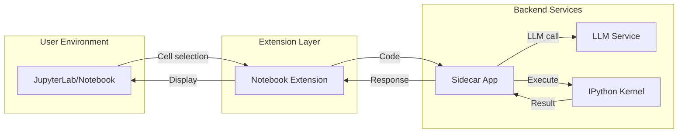

# 🧠 AI Code Assistant for Jupyter (Sidecar App)

## 📌 Background

Modern LLM-based code assistants are highly capable, but existing tools like Copilot or ChatGPT are not deeply integrated into the **interactive, cell-based workflows** of Jupyter notebooks — especially for **running code in controlled, isolated environments**.

This project aims to build an AI code assistant as a **sidecar application** to enhance a local Jupyter (Notebook and Lab) environment. It will operate independently, yet interact closely with the running notebook instance — allowing for LLM-assisted code analysis and **execution in a dedicated IPython kernel**.

---

## 🎯 Purpose & Goals

### 👨‍💻 For the User
- Ask an AI assistant to explain, debug, or enhance currently selected code cells.
- Execute code in a **sidecar kernel**, isolated from the user's notebook kernel.
- Display assistant feedback, execution results, and recommendations inside the notebook interface.
- Enable **safe prototyping** with access to a separate runtime.

### 🔐 For Deployment
- Operate as a **sidecar microservice** alongside a local JupyterLab instance.
- Communicate via REST or WebSocket.
- Avoid modifying Jupyter's core server behavior — run as an opt-in enhancement.

---

## 🧩 System Design Overview

### 📐 Architecture



🧳 Deployment Strategy
The assistant runs as a sidecar service to local JupyterLab.

Launch via:

```bash
jupyter lab &  # User launches JupyterLab
python backend/app.py  # Launch sidecar

```

Notebook communicates via HTTP (or WebSocket for advanced features).

# Project Todo List

## Core Infrastructure
- [x] Define purpose and high-level architecture
- [x] Scaffold the backend FastAPI sidecar service
- [x] Package sidecar app with script to launch it alongside JupyterLab

## Jupyter Extension Development
- [x] Build Jupyter Notebook extension (Classic) with:
  - [x] Toolbar button
  - [x] Selected cell access
  - [x] Modal feedback
- [x] Support both Jupyter Notebook and JupyterLab UIs
- [x] Implement basic chat interface in sidebar

## Backend Implementation
- [x] Manage sidecar IPython kernel using jupyter_client
- [x] Return stdout, stderr, and result objects cleanly
- [x] Mock backend response for UI testing

## Advanced Features
- [ ] Integrate optional LLM (OpenAI, Ollama, etc.)
- [ ] (Optional) Enable persistent variable sessions across executions

# Current Project Structure
```
jupyter-llm-ext/
├── backend/         # Backend service code (FastAPI mock LLM, streaming API)
│   ├── requirements.txt
│   ├── README.md    # Backend usage & API
│   └── src/
│       └── main.py  # FastAPI app, chat & health endpoints
├── jupyter-lab-extension/  # Frontend extension (JupyterLab)
│   ├── src/         # TypeScript source code (modular, chat UI, context tracking)
│   ├── style/       # CSS styles
│   ├── package.json # Node.js dependencies
│   └── README.md    # Frontend usage & dev
├── jupyter-simple-extension/ # (Scaffolded, for future use)
├── PROJECT.md       # English project documentation
└── README.md        # Chinese documentation
```

## Backend API (FastAPI)
- `POST /chat`: Streaming chat endpoint (mock LLM, markdown/code/SQL/TypeScript)
- `GET /health`: Health check
- See `backend/src/main.py` for details

## JupyterLab Extension
- Modular TypeScript architecture
- Sidebar chat UI
- Cell context tracking
- Connects to FastAPI backend for LLM chat

## Development Quickstart

```bash
# Backend
cd backend
pip install -r requirements.txt
python src/main.py

# Frontend
cd ../jupyter-lab-extension
npm install
npm run build
jupyter labextension install . --no-build
jupyter lab
```

---
For more details, see each component's README.
