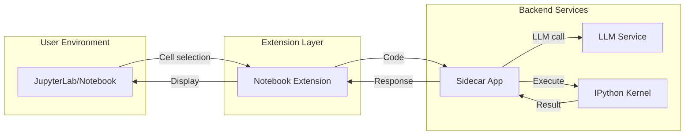

# 🧠 AI Code Assistant for Jupyter (Sidecar App)

## 📌 Background

Modern LLM-based code assistants are highly capable, but existing tools like Copilot or ChatGPT are not deeply integrated into the **interactive, cell-based workflows** of Jupyter notebooks — especially for **running code in controlled, isolated environments**.

This project aims to build an AI code assistant as a **sidecar application** to enhance a local Jupyter (Notebook and Lab) environment. It will operate independently, yet interact closely with the running notebook instance — allowing for LLM-assisted code analysis and **execution in a dedicated IPython kernel**.

---

## 🎯 Purpose & Goals

### 👨‍💻 For the User
- Ask an AI assistant to explain, debug, or enhance currently selected code cells.
- Execute code in a **sidecar kernel**, isolated from the user's notebook kernel.
- Display assistant feedback, execution results, and recommendations inside the notebook interface.
- Enable **safe prototyping** with access to a separate runtime.

### 🔐 For Deployment
- Operate as a **sidecar microservice** alongside a local JupyterLab instance.
- Communicate via REST or WebSocket.
- Avoid modifying Jupyter's core server behavior — run as an opt-in enhancement.

---

## 🧩 System Design Overview

### 📐 Architecture



🧳 Deployment Strategy
The assistant runs as a sidecar service to local JupyterLab.

Launch via:

```bash
jupyter lab &  # User launches JupyterLab
python backend/app.py  # Launch sidecar

```

Notebook communicates via HTTP (or WebSocket for advanced features).

# Project Todo List

## Core Infrastructure
- [ ] Define purpose and high-level architecture
- [ ] Scaffold the backend FastAPI sidecar service
- [ ] Package sidecar app with script to launch it alongside JupyterLab

## Jupyter Extension Development
- [ ] Build Jupyter Notebook extension (Classic) with:
  - [ ] Toolbar button
  - [ ] Selected cell access
  - [ ] Modal feedback
- [ ] Support both Jupyter Notebook and JupyterLab UIs

## Backend Implementation
- [ ] Manage sidecar IPython kernel using jupyter_client
- [ ] Return stdout, stderr, and result objects cleanly
- [ ] Mock backend response for UI testing

## Advanced Features
- [ ] Integrate optional LLM (OpenAI, Ollama, etc.)
- [ ] (Optional) Enable persistent variable sessions across executions

