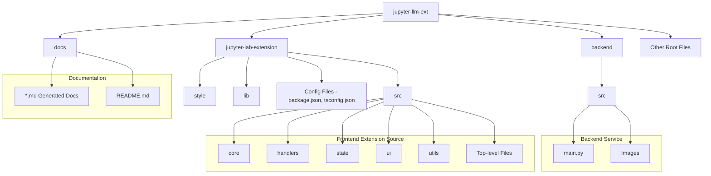
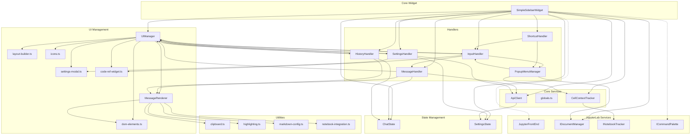
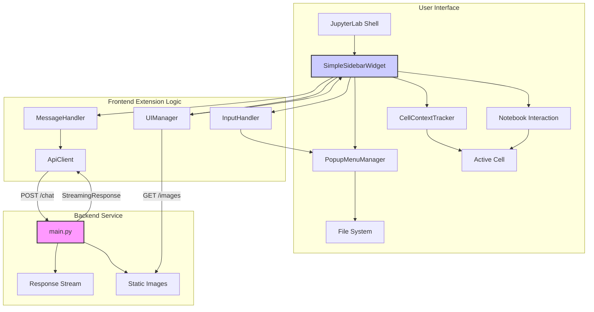

# Jupyter LLM Extension Documentation

This directory contains the detailed documentation for the `jupyter-llm-ext` project, covering both the backend service and the JupyterLab frontend extension.

## Overview

The documentation is organized as follows:

-   **This README:** Provides high-level diagrams and links to detailed documentation for specific modules.
-   **Backend Documentation:** Details about the FastAPI mock server (`backend/src/main.py`).
-   **Frontend Documentation:** Detailed explanations of the various TypeScript modules within the `jupyter-lab-extension/src/` directory, broken down by their function (core, handlers, state, UI, utils).

## Project Structure

This diagram shows the high-level directory structure of the project:

## Frontend Component Interactions

This diagram illustrates how the major components within the JupyterLab frontend extension interact with each other:

## Overall System Diagram

This diagram provides a simplified view of how the user interface, frontend extension logic, and backend service interact:

## Detailed Documentation

### Backend

-   [`backend/src/main.py`](./backend_main.md)

### Frontend (`jupyter-lab-extension/src/`)

**Top Level:**
-   [`index.ts`](./frontend_index.md) (Entry Point)
-   [`sidebar-widget.ts`](./frontend_sidebar_widget.md) (Main Widget)
-   [`commands.ts`](./frontend_commands.md)
-   [`cell-context-tracker.ts`](./frontend_cell_context_tracker.md)
-   [`types.ts`](./frontend_types.md)

**Core (`core/`):**
-   [`api-client.ts`](./frontend_core_api_client.md)
-   [`globals.ts`](./frontend_core_globals.md)
-   [`icons.ts`](./frontend_core_icons.md)

**Handlers (`handlers/`):**
-   [`history-handler.ts`](./frontend_handlers_history_handler.md)
-   [`input-handler.ts`](./frontend_handlers_input_handler.md)
-   [`message-handler.ts`](./frontend_handlers_message_handler.md)
-   [`popup-menu-manager.ts`](./frontend_handlers_popup_menu_manager.md)
-   [`settings-handler.ts`](./frontend_handlers_settings_handler.md)
-   [`shortcut-handler.ts`](./frontend_handlers_shortcut_handler.md)

**State (`state/`):**
-   [`chat-state.ts`](./frontend_state_chat_state.md)
-   [`settings-state.ts`](./frontend_state_settings_state.md)

**UI (`ui/`):**
-   [`code-ref-widget.ts`](./frontend_ui_code_ref_widget.md)
-   [`dom-elements.ts`](./frontend_ui_dom_elements.md)
-   [`layout-builder.ts`](./frontend_ui_layout_builder.md)
-   [`message-renderer.ts`](./frontend_ui_message_renderer.md)
-   [`settings-modal.ts`](./frontend_ui_settings_modal.md)
-   [`ui-manager.ts`](./frontend_ui_ui_manager.md)

**Utils (`utils/`):**
-   [`clipboard.ts`](./frontend_utils_clipboard.md)
-   [`highlighting.ts`](./frontend_utils_highlighting.md)
-   [`markdown-config.ts`](./frontend_utils_markdown_config.md)
-   [`notebook-integration.ts`](./frontend_utils_notebook_integration.md) 